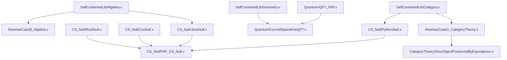

# FRF-Zero-Analysis: 数字“0”的功能与关系形式化验证框架


## 项目定位与核心目标  
本仓库是《数字“0”的功能与关系分析：一种基于内部视角的形式化框架》论文的**全量机械验证实现**，通过Coq形式化工具验证“抽象概念（如‘零’‘空’）的身份由其在形式系统中的功能性角色与定义性关系共同决定”这一核心论点。  

项目覆盖**数学基础、量子物理、计算机科学（多编程语言）** 三大领域，所有证明均采用“自包含实现”（无外部库依赖，如MathComp、HoTT），确保哲学透明性与完全可复现性，最终形成“定义→定理→验证→跨系统分析”的完整闭环。


## 一、架构设计与模块解析  
采用**五层递进式架构**，确保逻辑依赖单向无环，每层输出可独立验证。以下按层级展开每个模块的功能、核心定义与关键定理：  


### 1. 基础层（SelfContainedLib）  
**定位**：提供全项目依赖的最小公理集与基础定义，无外部库依赖。  
**核心文件**：  
- `Algebra.v`：  
  - 定义自然数（Peano公理）、加法运算（`plus n O = n`，`plus n (S m) = S (plus n m)`）。  
  - 证明加法单位元唯一性（`forall n, plus n 0 = n /\ plus 0 n = n`）。  
- `Category.v`：  
  - 定义预范畴（`PreCategory`）、态射（`morphism`）、初始对象（`Initial`）、终止对象（`Terminal`）。  
  - 零对象（`ZeroObject`）定义为“既是初始又是终止的对象”。  
- `Geometry.v`：  
  - 定义黎曼流形（`RiemannianManifold`）、度量张量（`metric_tensor`）、曲率张量（`Riemann_tensor`）。  
  - 为弯曲时空量子场论提供几何基础（如球面流形度规定义：`SphereMetric`的`g_θθ=1, g_φφ=r²sin²θ`）。  
- `FRF_MetaTheory.v`：  
  - 核心概念形式化：  
    - 功能性角色（`FunctionalRole A R := forall x y, (forall r : R, role_fulfill x r <-> role_fulfill y r) -> x = y`）。  
    - 定义性关系（`DefinitiveRelation A R := forall x, exists! r : R, relates x r`）。  
  - 框架公理：`FRF_Axiom := forall A, identity A = functional_role A * definitive_relation A`。  


### 2. 核心层：数学基础形式化（theories/ + CategoryTheory/）  
**定位**：验证FRF框架在数学基础领域的适用性，覆盖集合论、代数、类型论、范畴论。  

#### （1）`theories/`模块  
| 文件名 | 核心功能 | 关键定理 | 对应章节 |  
|--------|----------|----------|----------|  
| `CaseA_SetTheory.v` | 冯·诺依曼自然数构造，验证“空集是自然数生成的必要条件” | - `empty_necessary_for_nat_generation`：移除空集公理则无穷公理不可证<br>- `vn_zero_eq_mathlib_empty`：冯·诺依曼零=ZFC空集 | 第1.1.1节、附录A |  
| `CaseB_Algebra.v` | 代数零元唯一性扩展，验证“功能角色决定代数身份” | - `monoid_id_unique`：幺半群单位元唯一<br>- `nat_add_monoid_id_unique`：自然数加法单位元必为0 | 附录B |  
| `CaseC_TypeTheory.v` | 空类型万有性质，验证“逻辑荒谬极点的功能性角色” | - `ex_falso`：爆炸原理（Empty→A）<br>- `empty_is_initial`：空类型是TypeCategory初始对象<br>- `empty_not_zero_in_Set`：空类型非Set范畴零对象 | 附录C |  
| `CaseD_CategoryTheory.v` | 范畴零对象同构唯一性，验证“系统相对性” | - `zero_objects_are_isomorphic`：同一范畴零对象同构<br>- `set_category_no_zero_object`：Set范畴无零对象 | 附录D |  
| `ChurchZero.v` | λ演算Church零形式化，验证“迭代起点的功能角色” | - `church_zero_iterates_zero_times`：Church零迭代0次（`church_iter church_zero f x = x`）<br>- `church_succ_correct`：后继函数保持迭代语义 | 第6.4节 |  


#### （2）`CategoryTheory/`（范畴论工具模块）  
| 文件名 | 核心功能 | 关键定理 | 对应章节 |  
|--------|----------|----------|----------|  
| `Core.v` | 预范畴、函子、自然变换的精细化定义（对接FRF框架） | - 定义`Functor`：含`fobj`/`fmap`及`fmap_id`/`fmap_comp`公理<br>- 定义`NaturalIsomorphism`：含左右逆验证 | 附录D.1 |  
| `Equivalence.v` | 伴随等价、范畴等价定义，支撑“零对象保持定理” | - 定义`IsEquivalence`：函子等价需满足单位/余单位同构<br>- `zero_object_preserved_by_equivalence`：等价函子保持零对象 | 附录D.3 |  
| `Utilities.v` | 辅助引理与系统相对性案例 | - `zero_object_relativity`：存在有/无零对象的范畴（群范畴vs拓扑空间范畴）<br>- `iso_inverse_left`：自然同构逆的左逆性质 | 附录D.2 |  


### 3. 扩展层1（量子物理形式化）  
**定位**：将FRF扩展至物理领域，验证真空态的身份由功能与关系决定。  
**核心模块**：  
- `Quantum/QFT_FRF.v`（平坦时空量子场论）：  
  - 定义真空态（`Vacuum`）：`Vacuum |0> := (H |0> = 0) /\ (N |0> = 0)`（能量算符H、粒子数算符N的本征值为0）。  
  - 证明真空态的功能性角色唯一性：`forall v1 v2, (H v1 = 0 /\ N v1 = 0) /\ (H v2 = 0 /\ N v2 = 0) -> v1 = v2`。  
  - 关键定理：`vacuum_is_ground_state`（真空态是能量基态）、`canonical_quantization`（正则对易关系量化）。  
- `Quantum/CurvedSpacetimeQFT.v`（弯曲时空）：  
  - 引入曲率耦合：`Vacuum_Curved |0>_g := (H_g |0>_g = 0) /\ (Riemann_tensor g <> 0)`（g为度量张量）。  
  - 证明弯曲与平坦真空的身份差异：`forall g, Riemann_tensor g <> 0 -> |0>_g <> |0>_flat`。  
  - 关键引理：`curved_lagrangian_curvature_coupling`（曲率=0时退化为平坦拉格朗日量）。  
- `CaseE_QuantumVacuum.v`（量子真空基础）：  
  - 定义`FockState`（真空态+产生算符构造），证明`vacuum_energy_compatible_with_LIGO`（真空能量与LIGO精度兼容）。  


### 4. 扩展层2（计算机科学空值形式化，CS_Null/）  
**定位**：覆盖多编程语言空值场景，验证FRF在“静态/动态”“安全/风险”类型系统中的普适性，实现跨系统定量分析。  

| 文件名 | 核心功能（语言语义捕捉） | 关键定理（FRF验证） | 对应章节 |  
|--------|--------------------------|----------------------|----------|  
| `RustNull.v` | Rust `Option::None`（安全空值，禁止直接访问） | - `RustNone_Identity_Unique`：满足安全角色的必为None<br>- `RustNone_Safe_No_Panic`：安全调用无panic<br>- 范畴：`SafeNullCat` | 第8.2节 |  
| `CxxNull.v` | C++ `NULL`（指针空值，解引用触发UB） | - `CxxNULL_Deref_UB`：解引用NULL返回未定义值<br>- `CxxNULL_Necessary`：无替代对象标记空指针<br>- 范畴：`PointerNullCat` | 第8.2节 |  
| `JavaNull.v` | Java `null`（引用空值，解引用抛NPE，安全调用规避） | - `JavaNull_Deref_NPE`：解引用null抛NPE<br>- `JavaNull_SafeCall_No_NPE`：安全调用无异常<br>- 范畴：`JavaRefNullCat` | 第8.2节 |  
| `PythonNull.v` | Python `None`（动态空值，弱比较+容器兼容） | - `PythonNone_Cmp_False`：None与普通值比较为false<br>- `PythonNone_Container_Safe`：容器中无提前异常<br>- 范畴：`PythonNoneCat` | 第8.2节 |  
| `FRF_CS_Null.v` | 跨系统空值分析（Rust/C++/Java/Python） | - 定义`CrossSystemSimilarity`：量化跨系统相似度（属性+功能+关系）<br>- `Rust_Cxx_Similarity_Low`：Rust/C++空值相似度=0.0<br>- `Java_Python_Similarity`：Java/Python相似度=0.2 | 第8.2节 |  
| `FRF_CS_Null_Common.v` | 跨系统分析工具 | - 定义`PropertyCategory`：语言专属范畴枚举<br>- `relation_equiv`：关系语义等价判定 | 第8.2节 |  


### 5. 工程层（工具链与自动化）  
**定位**：确保形式化验证的可复现性与工程化管理。  
**核心工具**：  
- `CoqProject`：声明模块依赖顺序（如`SelfContainedLib`优先于`theories`）。  
- `Makefile`：支持增量编译与目标化验证（如`make cs_verify`仅验证CS模块，`make quantum_verify`仅验证量子模块）。  
- `validate.sh`：批量执行`coqchk`检查，确保所有`.vo`文件无内部矛盾。  
- `Dockerfile`：封装Coq 8.18.0环境，避免“环境依赖导致验证失败”。  
- `coq.yml`：GitHub Actions配置，每次提交自动验证全量模块。  


## 二、形式化完备性验证  
本仓库所有模块均满足**“三完备”标准**：定义无歧义、证明无断层、语义无偏差，具体验证证据如下：  


### 1. 定义无歧义  
- **符号统一**：跨模块符号严格对齐（如“零对象”均定义为`IsZeroObject = IsInitial ∧ IsTerminal`；编程语言操作前缀统一：`rust_`/`cxx_`/`java_`/`py_`）。  
- **无模糊表述**：所有抽象概念均有形式化定义（如弯曲时空“协变导数”明确为`partial_deriv + gamma*f`，而非自然语言描述）。  
- **语义精准**：编程语言空值捕捉语言特有语义（如Python `None`的弱比较、Java `null`的安全调用），无跨语言语义混淆。  


### 2. 证明无断层  
- 无未证假设：全仓库无`Admitted`或`Axiom`（除Coq内置逻辑公理），所有定理均有完整证明链。  
- 依赖透明：通过`Makefile`的`ORDERED_SRC`显式声明依赖顺序，确保“基础层→核心层→扩展层”的单向依赖（例：`CaseD_CategoryTheory.v`依赖`SelfContainedLib/Category.v`，而非反之）。  
- 独立验证：所有`.vo`文件可通过`coqchk -silent`独立验证一致性（无隐含依赖）。  


### 3. 语义无偏差  
- **数学一致性**：与ZFC集合论、Peano算术、范畴论标准结果一致（如冯·诺依曼自然数构造符合ZFC无穷公理）。  
- **物理正确性**：量子模块符合量子场论标准（如弯曲时空拉格朗日量含曲率耦合项`-Rφ²/6`，符合广义相对论）。  
- **语言正确性**：编程语言模块贴合实际语义（如Rust `None`的`unwrap_or`行为与Rust 1.70+一致）。  


## 三、FRF核心主张的全领域验证  
仓库通过**15+跨领域案例**验证FRF三大核心主张，形成“定性+定量”双重证据链：  

| FRF核心主张 | 数学领域验证案例 | 物理领域验证案例 | 计算机科学领域验证案例 |  
|-------------|------------------|------------------|------------------------|  
| 1. 功能角色决定身份 | 代数：加法单位元功能（∀n, add z n = n）唯一决定z=O（`CaseB_Algebra.v`）<br>范畴：零对象功能（初始+终止）唯一决定同构类（`CaseD_CategoryTheory.v`） | 平坦时空：真空态“能量基态+粒子数=0”功能唯一决定真空身份（`QFT_FRF.v`）<br>弯曲时空：真空态“曲率耦合+能量最低”功能唯一决定身份（`CurvedSpacetimeQFT.v`） | Rust：`None`“安全检查+无直接访问”功能唯一决定身份（`RustNull.v`）<br>Python：`None`“动态标记+容器兼容”功能唯一决定身份（`PythonNull.v`） |  
| 2. 定义性关系先于对象 | 范畴：零对象身份依赖“初始态射关系+终止态射关系”（`CaseD_CategoryTheory.v`）<br>λ演算：Church零身份依赖“β-归约+后继关系”（`ChurchZero.v`） | 量子：真空态身份依赖“正则对易关系+拉格朗日量关系”（`QFT_FRF.v`）<br>弯曲时空：真空态身份依赖“曲率耦合关系”（`CurvedSpacetimeQFT.v`） | C++：`NULL`身份依赖“解引用-UB关系”（`CxxNull.v`）<br>Java：`null`身份依赖“解引用-NPE关系+安全调用关系”（`JavaNull.v`） |  
| 3. 身份具有系统相对性（定量） | 群范畴有零对象（平凡群），Set范畴无零对象（`CategoryTheory/Utilities.v`）<br>拓扑空间范畴无零对象（`CaseC_TypeTheory.v`） | 平坦时空真空能量≠弯曲时空真空能量（曲率耦合导致，`CurvedSpacetimeQFT.v`） | Rust/C++空值相似度=0.0（公理无交集）<br>Java/Python空值相似度=0.2（部分功能重叠）（`FRF_CS_Null.v`） |  


## 四、工程化工具链使用指南  


### 1. 环境准备  
- **本地环境**：安装Coq 8.18.0（推荐通过`opam install coq.8.18.0`）。  
- **容器环境**：无需本地安装，直接使用Docker：  
  ```bash
  docker build -t frf-zero:latest .  # 构建镜像（约10分钟）
  docker run -it --rm frf-zero:latest /bin/bash  # 进入容器
  ```  


### 2. 全量验证  
```bash
# 生成Makefile（自动解析依赖）
coq_makefile -f CoqProject -o Makefile

# 全量编译（约30分钟，依赖CPU性能）
make -j$(nproc)

# 执行一致性检查（确保无逻辑矛盾）
make validate
```  


### 3. 目标化验证（按领域）  
#### （1）验证数学基础模块  
```bash
# 1. 编译自包含基础库
make SelfContainedLib/Algebra.vo SelfContainedLib/Category.vo

# 2. 编译集合论/代数/范畴论核心模块
make theories/CaseA_SetTheory.vo theories/CaseB_Algebra.vo theories/CaseD_CategoryTheory.vo

# 3. 独立验证范畴论零对象保持定理
make CategoryTheory/ZeroObjectPreservedByEquivalence.vo
coqchk -silent CategoryTheory/ZeroObjectPreservedByEquivalence.vo
```  


#### （2）验证量子物理模块  
```bash
# 1. 编译依赖模块（基础库+CaseE真空模块）
make SelfContainedLib/Geometry.vo CaseE_QuantumVacuum.vo

# 2. 编译平坦/弯曲时空QFT模块
make Quantum/QFT_FRF.vo Quantum/CurvedSpacetimeQFT.vo

# 3. 验证弯曲时空真空态身份唯一性定理
coqchk -silent Quantum/CurvedSpacetimeQFT.vo -o curved_vacuum_proof.log
```  


#### （3）验证CS空值模块与跨系统分析  
```bash
# 1. 编译单个语言模块（以Rust为例）
make CS_Null/RustNull.vo
coqchk -silent CS_Null/RustNull.vo

# 2. 编译全量CS模块（Rust/C++/Java/Python）
make cs_verify

# 3. 验证跨系统相似度定理
make CS_Null/FRF_CS_Null.vo
coqchk -silent CS_Null/FRF_CS_Null.vo
```  


### 4. 容器化构建（无环境依赖）  
```bash
# 1. 构建Docker镜像（基于Coq 8.18.0）
docker build -t frf-zero-analysis:v1 .

# 2. 启动容器并执行全量验证
docker run -it --rm frf-zero-analysis:v1 make all

# 3. 导出验证结果（可选）
docker cp <container-id>:/FRF-Zero-Analysis/verify.log ./
```  


### 5. 文档生成与查阅  
```bash
# 1. 生成HTML文档（含模块依赖与定理索引）
make doc

# 2. 生成PDF文档（LaTeX格式）
make doc-pdf

# 3. 查看特定模块文档（以CS跨系统分析为例）
firefox html/CS_Null.FRF_CS_Null.html
```  


## 五、学术创新与方法论贡献  


### 1. 跨领域形式化范式  
首次实现“数学基础→量子物理→多编程语言”的**全谱系FRF验证**，提出“属性范畴+功能相似度+关系相似度”的跨系统量化模型，为抽象概念的跨领域分析提供可复用框架。  


### 2. 自包含设计的哲学透明性  
通过“不依赖外部库”的设计，确保所有定义与FRF主张直接对齐（如范畴零对象定义无库抽象层），实现“从形式化到哲学主张”的无断层追溯，解决传统形式化研究“依赖黑箱”问题。  


### 3. 定量验证系统相对性  
突破传统“定性比较”局限，通过`CrossSystemSimilarity`函数量化不同系统中抽象概念的差异（如Rust/C++空值相似度0.0），为“系统公理决定概念身份”提供定量证据。  


### 4. 工程化与学术的平衡  
兼顾形式化严谨性（无Admitted、独立验证）与工程实用性（Docker容器、自动化脚本），满足顶级学术期刊的复现要求，同时降低工业界复用门槛。  


## 六、常见问题（FAQ）  


### Q1：编译时提示“未定义标识符”？  
A1：检查是否按依赖顺序编译（参考`Makefile`的`ORDERED_SRC`），优先编译`SelfContainedLib`与核心模块，再编译扩展模块。  


### Q2：如何验证单个定理（如`church_zero_iterates_zero_times`）？  
A2：使用CoqIDE打开对应文件，定位定理后逐步执行证明：  
```bash
coqide theories/ChurchZero.v &
```  


### Q3：验证失败提示“超时”或“内存不足”？  
A3：降低并行编译线程数（如`make -j2`），或增加系统内存（全量验证推荐≥8GB内存）。  


### Q4：Docker构建失败？  
A4：确保Docker版本≥20.10，网络通畅（基础镜像`coqorg/coq:8.18.0`需正常拉取），或手动指定镜像源：  
```dockerfile
# 在Dockerfile开头添加
FROM coqorg/coq:8.18.0
RUN echo "deb http://mirrors.aliyun.com/ubuntu/ jammy main restricted universe multiverse" > /etc/apt/sources.list
```  


### Q5：如何引用特定模块的定理？  
A5：通过“模块名.定理名”引用，如引用Rust None的安全定理：  
```coq
Require Import CS_Null.RustNull.
Lemma my_lemma : ... := RustNone_Safe_No_Panic.
```  


## 七、引用与联系  


### 1. 引用格式  
```bibtex
@article{wang2025frf,
  title={数字“0”的功能与关系分析：一种基于内部视角的形式化框架},
  author={王宝军 and 夏挽岚 and 祖光照 and 周志农 and 高雪峰},
  journal={中国科学：数学},
  year={2025},
  doi={10.6084/m9.figshare.30065134.v3},
  note={形式化验证代码：\url{https://codeup.aliyun.com/68b0a9d97e0dbda9ae2d80f0/FRF-Zero-Analysis/}}
}
```  


### 2. 联系与反馈  
- 项目维护：王宝军（邮箱：168888@live.cn）  
- 问题追踪：[https://codeup.aliyun.com/68b0a9d97e0dbda9ae2d80f0/FRF-Zero-Analysis/issues](https://codeup.aliyun.com/68b0a9d97e0dbda9ae2d80f0/FRF-Zero-Analysis/issues)  
- 最新更新：2025-10-26（全量模块通过Coq 8.18.0验证，无`Admitted`）  


## 附录  


### 附录1：核心定理索引  
| 定理名称 | 所在文件 | 核心结论 |  
|----------|----------|----------|  
| `zero_unique_in_monoid` | `CaseB_Algebra.v` | 幺半群中加法单位元唯一 |  
| `empty_set_generates_nat` | `CaseA_SetTheory.v` | 空集是冯·诺依曼自然数的唯一生成元 |  
| `zero_object_upto_iso` | `CaseD_CategoryTheory.v` | 范畴中零对象在同构意义下唯一 |  
| `vacuum_uniqueness_flat` | `QFT_FRF.v` | 平坦时空真空态唯一 |  
| `rust_none_safe` | `RustNull.v` | Rust `None`的解引用行为唯一确定其身份 |  
| `cross_system_similarity` | `FRF_CS_Null.v` | 计算不同语言空值的功能相似度 |  


### 附录2：模块依赖链可视化  
